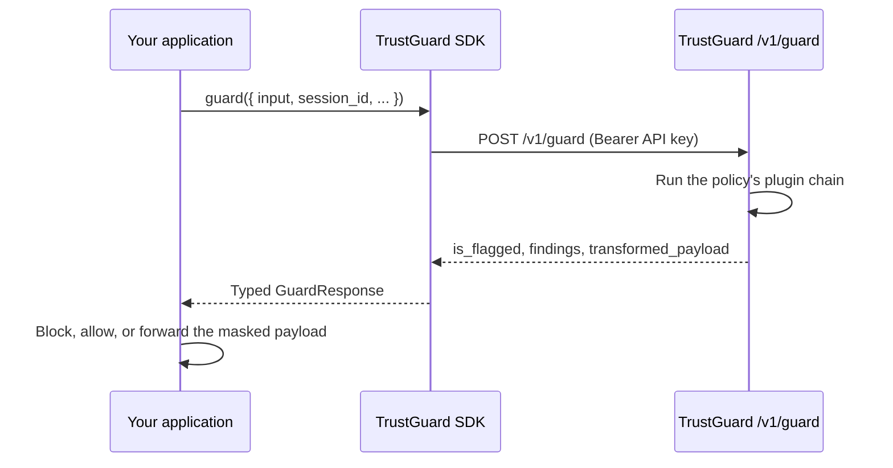

# TrustGuard SDKs

[](https://github.com/NeuralTrust/trustguard-sdk/actions/workflows/ci.yml)
[](https://www.npmjs.com/package/@neuraltrust/trustguard-sdk)
[](https://pypi.org/project/neuraltrust-trustguard/)
[](https://pkg.go.dev/github.com/NeuralTrust/trustguard-sdk/go)
[](LICENSE)

Official client SDKs for the [TrustGuard](https://neuraltrust.ai) runtime guard API (`POST /v1/guard`).

Each SDK is a thin, typed client around a single endpoint: you configure a **base URL** and an **API key**, send the payload you want evaluated, and get back the verdict. TrustGuard detects — prompt injection, jailbreaks, PII, toxicity, and whatever else the policy attached to your API key runs — and **your code enforces**: block when `is_flagged` is true.

| Language | Package | Install | Docs |
|---|---|---|---|
| Node.js / TypeScript | `@neuraltrust/trustguard-sdk` | `npm install @neuraltrust/trustguard-sdk` | [`node/`](node/) |
| Python (sync + async) | `neuraltrust-trustguard` | `pip install neuraltrust-trustguard` | [`python/`](python/) |
| Go | `github.com/NeuralTrust/trustguard-sdk/go` | `go get github.com/NeuralTrust/trustguard-sdk/go` | [`go/`](go/) |

## How it works



## Quick start

**Node.js**

```typescript
import { TrustGuard } from "@neuraltrust/trustguard-sdk";

const client = new TrustGuard({ baseUrl: "https://guard.example.com", apiKey: process.env.TRUSTGUARD_API_KEY! });
const res = await client.guard({ input: { prompt: "user text" } });
if (res.isFlagged) {
  // block the request
}
```

**Python**

```python
from trustguard import TrustGuard

with TrustGuard("https://guard.example.com", api_key="...") as client:
    res = client.guard({"prompt": "user text"})
    if res.is_flagged:
        ...  # block the request
```

**Go**

```go
client, _ := trustguard.New("https://guard.example.com", os.Getenv("TRUSTGUARD_API_KEY"))
res, err := client.Guard(ctx, trustguard.GuardRequest{Input: map[string]any{"prompt": "user text"}})
if err == nil && res.IsFlagged {
    // block the request
}
```

Runnable versions of these — plus async Python, attachments, and error handling — live in [`examples/`](examples/).

## What you can send

Beyond `input`, every SDK supports the same optional context:

| Option | Purpose |
|---|---|
| `direction` | `input` (default) evaluates what goes *into* the model, `output` what comes back |
| `session_id` | Groups multi-turn conversations for session-aware detections |
| `consumer_id` | Identifies the end user behind the request |
| `metadata.policy_id` | Selects the policy when the API key is allowed more than one |
| attachments | Documents (base64-encoded on the wire) for file-aware plugins |

And every response carries `is_flagged`, the full `findings` list, the `transformed_payload` when a masking plugin rewrote content, and `trace_id`/`request_id` for support and telemetry.

## Releasing

Releases are tag-driven, one tag namespace per language; each package versions independently:

| Language | Tag | Effect |
|---|---|---|
| Node | `node-vX.Y.Z` | CI publishes to npm (requires `NPM_TOKEN` secret) |
| Python | `python-vX.Y.Z` | CI builds and publishes to PyPI (trusted publishing) |
| Go | `go/vX.Y.Z` | Nothing to publish — Go consumers fetch the module from git; the `go/` prefix is the standard convention for a module living in the `go/` subdirectory |

Bump the version in the package manifest (`node/package.json` / `python/pyproject.toml`) before tagging, and update [`CHANGELOG.md`](CHANGELOG.md). Go has no manifest version; the tag is the version.

## Contributing

Contributions are welcome — see [CONTRIBUTING.md](CONTRIBUTING.md) for the development setup, testing requirements, and the API-contract rules that keep the three SDKs consistent. Security issues go through [SECURITY.md](SECURITY.md), never public issues.

- `node/`: `npm install && npm run lint && npm test && npm run build`
- `python/`: `pip install -e '.[dev]' && ruff check . && pytest`
- `go/`: `go vet ./... && go test ./...`

## License

[MIT](LICENSE) © NeuralTrust
